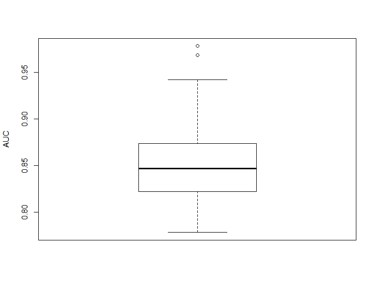
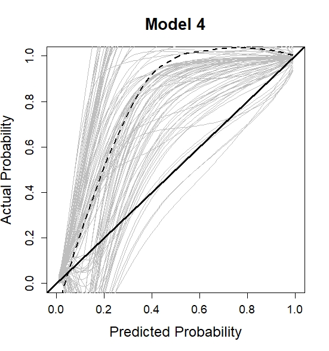
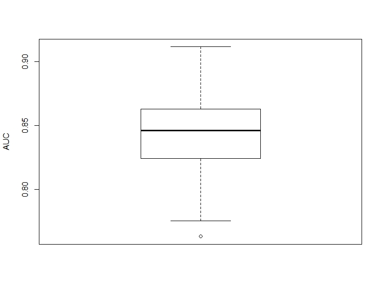
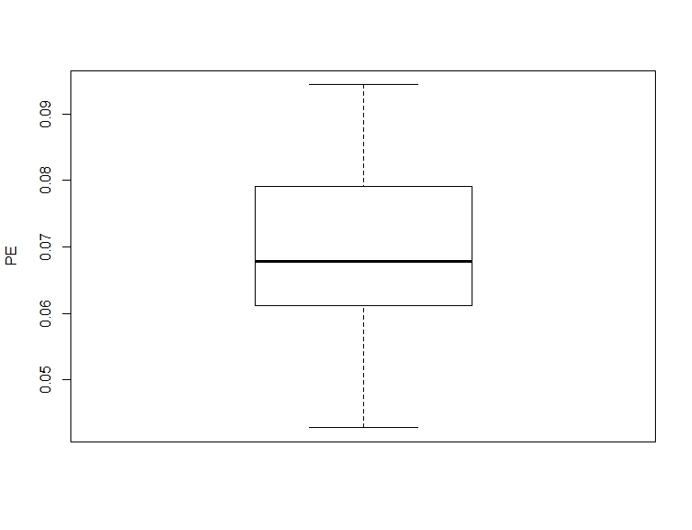

<span style="color:red; font-weight:bold; font-size:4em;"> Under construction </span>


In this webpage, we describe and show the analysis that was performed in the manuscipt: _Dynamic prediction using joint models of longitudinal and time-to-event data_

```{r setup, include=FALSE}
knitr::opts_chunk$set(echo = TRUE, comment = NA, message=FALSE, warning=FALSE)
library(JMbayes)
library(lattice)
library(splines)
library(effects)
```

# Packages 

The <code>R</code> packages and versions that are used cen be seen below:

```{r packages2, results='asis', echo=FALSE}
library(dplyr)
library(kableExtra)
library(gifski)
x <- c("JMbayes", "lattice", "splines", "effects")
Rpack <- lapply(x, FUN = function(x) packageVersion(x))
Rpack <- lapply(Rpack, FUN = function(x) as.character(x))
names(Rpack) <- x

Rpack <- data.frame(R = R.Version()$version.string, (Rpack))
colnames(Rpack)[1] <- "**Software**:"

kable(t(Rpack),  caption = "", format = "html") %>%
column_spec(1, width = c("7em")) %>%
column_spec(2, width = c("15em"))
```

\

# Analysis
A first imporant step is to investigate the data set. More details can be found in the tab **Data**.

## Fit a joint model

A mixed-effects submodel can be fitted using the <code>lme</code> function as:
```{r, cache=TRUE}
fit_nonlinear2 <- lme(log(serBilir) ~ ns(year, 3) + age + sex + drug, 
                      random = list(id = pdDiag(form = ~ ns(year, 3))), 
                      data = pbc2)
```

A survival submodel can be fitted using the <code>coxph</code> function as:
```{r, cache=TRUE}
survFit.pbc <- coxph(Surv(years, status2) ~ age + sex + drug, data = pbc2.id, x = TRUE)
```

Then the joint model can be fitted using the <code>jointModelBayes</code> function as:
```{r, cache=TRUE}
jointFit.pbc <- jointModelBayes(fit_nonlinear2, survFit.pbc, timeVar = "year", 
                                baseHaz = "regression-splines", verbose = FALSE)
summary(jointFit.pbc)
```


In order to visualize
```{r, cache=TRUE}
ef <- Effect(c("year", "drug"), fit_nonlinear2, typical=mean, given.values=c(sexfemale=1))

trellis.par.set(strip.background=list(col="lightgrey"))

plot(ef, ylab = list("log serum bilirubin", cex = 1.2), xlab = list("Year", cex = 1.2), 
     rug = FALSE, colors = 1, lwd = 2, grid = TRUE, main = "")
```


## Obtain dynamic predictions
```{r, cache=TRUE}
newdata_5 <- pbc2[pbc2$id == 5, ]

survRes_5 <- list()
for (o in 1:dim(newdata_5)[1]) {
  newdataDyn_5 <- newdata_5[1:o, ]
  survRes_5[[o]] <- survfitJM(object = jointFit.pbc, newdata = newdataDyn_5, idVar = "id", simulate = TRUE, 
                                      survTimes = NULL, last.time = NULL, M = 200, 
                                      CI.levels = c(0.025, 0.975), scale = 1.6)
 }
```

```{r, cache=TRUE, animation.hook='gifski', fig.show='animate'}
for (i in 1:dim(newdata_5)[1]) {
  plot.survfit.JMbayes(survRes_5[[i]], estimator = "mean", conf.int = TRUE, include.y = TRUE, 
                       lwd = 2, col = 1, cex.lab.z = 0.8,
                       ylab2 = "log Serum bilirubin", ylab = "Event-free Probability", 
                       xlab = "Year", mgp = c(1.7, 0.5, 0), 
                       main = paste0("Patient ", unique(newdata_5$id), ", Visit ", i))
}   
```


```{r, cache=TRUE}
newdata_15 <- pbc2[pbc2$id == 15, ]

survRes_15 <- list()
for (o in 1:dim(newdata_15)[1]) {
  newdataDyn_15 <- newdata_15[1:o, ]
  survRes_15[[o]] <- survfitJM(object = jointFit.pbc, newdata = newdataDyn_15, idVar = "id", simulate = TRUE, 
                                      survTimes = NULL, last.time = NULL, M = 200, 
                                      CI.levels = c(0.025, 0.975), scale = 1.6)
 }
```

```{r, cache=TRUE, animation.hook='gifski', fig.show='animate'}
for (i in 1:dim(newdata_15)[1]) {
  plot.survfit.JMbayes(survRes_15[[i]], estimator = "mean", conf.int = TRUE, include.y = TRUE, 
                       lwd = 2, col = 1, cex.lab.z = 0.8,
                       ylab2 = "log Serum bilirubin", ylab = "Event-free Probability", 
                       xlab = "Year", mgp = c(1.7, 0.5, 0),
                       main = paste0("Patient ", unique(newdata_15$id), ", Visit ", i))
}  
```


```{r, cache=TRUE}
newdata_42 <- pbc2[pbc2$id == 42, ]

survRes_42 <- list()
for (o in 1:(dim(newdata_42)[1]-3)) {
  newdataDyn_42 <- newdata_42[1:o, ]
  survRes_42[[o]] <- survfitJM(object = jointFit.pbc, newdata = newdataDyn_42, idVar = "id", simulate = TRUE, 
                                      survTimes = NULL, last.time = NULL, M = 200, 
                                      CI.levels = c(0.025, 0.975), scale = 1.6)
 }
```


```{r, cache=TRUE, animation.hook='gifski', fig.show='animate'}
for (i in 1:(dim(newdata_42)[1]-3)) {
  plot.survfit.JMbayes(survRes_42[[i]], estimator = "mean", conf.int = TRUE, 
                       include.y = TRUE, lwd = 2, col = 1, cex.lab.z = 0.8,
                       ylab2 = "log Serum bilirubin", ylab = "Event-free Probability", 
                       xlab = "Year", mgp = c(1.7, 0.5, 0),
                       main = paste0("Patient ", unique(newdata_42$id), ", Visit ", i))
}  
```


## Evaluate the predictions

First load the functions for the calibration curves that are presented in the tab **Functions**.

```{r, cache=FALSE, include = FALSE}
source("calJM.R")
```

### Model 1

Fit a joint model as before. In particular, we assume a linear mixed-effects submodel with a linear time structure in both the fixed and the random effects. We, moreover, assume the underlying value of serum bilirubin to be associated with the survival outcome.

```{r, cache = TRUE, eval = FALSE}
fit1 <- lme(log(serBilir) ~ year + age + sex + drug, random =~ year | id, data = pbc2)
survFit1 <- coxph(Surv(years, status2) ~ age + sex + drug, data = pbc2.id, x = TRUE)
jointFit1 <- jointModelBayes(fit1, survFit1, timeVar = "year", 
                                baseHaz = "regression-splines", verbose = FALSE)
```

The predictive performance measures are first obtained using the original data set. We assume a prediction window of 5 - 7 years.

```{r, cache=TRUE, eval = FALSE}
auc_app <- aucJM(jointFit1, newdata = pbc2,
             Tstart = 5, Thoriz = 7)
pe_app <- prederrJM(jointFit1, newdata = pbc2,
                Tstart = 5, Thoriz = 7)
cal_app <- calJM(jointFit1, newdata = pbc2,
               Tstart = 5, Thoriz = 7)
```

We calculate the optimist as below.

```{r, cache=TRUE, eval = FALSE}
n <- dim(pbc2.id)[1]
auc_opt <- numeric()
pe_opt <- numeric()
cal_opt_lin <- list()
cal_opt_poly <- list()

for (i in 1:100) {
  print(i)
  # A sample of size n is generated with replacement from the original data set, 
  # where patients are drawn by identification number.
  set.seed(2020 + i)
  n_new <- sample(1:n, n, replace=TRUE)
  n_new <- sort(n_new, decreasing = FALSE)
  
  trainingData <- NULL
  k <- 1
  for (j in 1:length(n_new)){
    n_len <- length(pbc2$id[pbc2$id %in% n_new[j]])
    newdata <- pbc2[pbc2$id %in% n_new[j],]
    newdata$id <- as.numeric(newdata$id)
    newdata$id <- k
    trainingData <- rbind(trainingData, newdata)
    k <- k + 1
  }
  trainingData.id <- trainingData[!duplicated(trainingData$id), ]
  
  # A new model is fitted using the generated sample and including
  # all n patients and all time points.
  fit1 <- lme(log(serBilir) ~ year + age + sex + drug, 
                        random =~ year | id,
                        data = trainingData)
  survFit1 <- coxph(Surv(years, status2) ~ age + sex + drug, 
                       data = trainingData.id, x = TRUE)
  jointFit1 <- jointModelBayes(fit1, survFit1, timeVar = "year", 
                                  baseHaz = "regression-splines")
  
  # The performance measures for the model are tested on the bootstrap data set
  # but using only the data up to time t.
  auc_boot <- aucJM(jointFit1, newdata = trainingData,
               Tstart = 5, Thoriz = 7)
  pe_boot <- prederrJM(jointFit1, newdata = trainingData,
                  Tstart = 5, Thoriz = 7)
  cal_boot <- calJM(jointFit1, newdata = trainingData,
                       Tstart = 5, Thoriz = 7)
  
  # The performance of the model is also evaluated on the original data set up to time t.
  auc_orig <- aucJM(jointFit1, newdata = pbc2,
                    Tstart = 5, Thoriz = 7)
  pe_orig <- prederrJM(jointFit1, newdata = pbc2,
                       Tstart = 5, Thoriz = 7)
  cal_orig <- calJM(jointFit1, newdata = pbc2,
                       Tstart = 5, Thoriz = 7)
  
  # The optimism in the prediction performance is estimated by subtracting the measures boot and org.
  auc_opt[i] <- auc_boot$auc - auc_orig$auc
  pe_opt[i] <- pe_boot$prederr - pe_orig$prederr
  cal_opt_lin[[i]] <- cal_boot$log.cal.curve$y - cal_orig$log.cal.curve$y
  cal_opt_poly[[i]] <- cal_boot$log.cal.curve.poly$y - cal_orig$log.cal.curve.poly$y
}
```


Finally, we obtain the corrected measures and present the results.

```{r, cache=TRUE, eval = FALSE}
auc_corr = auc_app1$auc - auc_opt
pe_corr = pe_app1$prederr + pe_opt
cal_corr = lapply(cal_opt, function(x) {cal_app$log.cal.curve.poly$y - x}) 

cal_opt_means <- colMeans(do.call(rbind,cal_opt))
cal_corr_means <- cal_app$log.cal.curve.poly$y - cal_opt_means

plot(0.5, 0.5, xlim = c(0,1), ylim = c(0,1), type = "n", 
     xlab = "Predicted Probability", 
     ylab = "Actual Probability",
     main = "Model 1",
     cex.axis = 1.2, cex.lab = 1.5, cex.main = 1.7)
lapply(cal_corr, function(x) lines(cal_app$log.cal.curve.poly$x, x, col ="grey"))
abline(0, 1, lwd = 3, col = 1)
lines(cal_app$log.cal.curve.poly$x, cal_corr_means, col = 1, lwd = 2 , lty = 2)

boxplot(auc_corr, ylab = "AUC")

boxplot(pe_corr, ylab = "PE")
```





### Model 4

Fit a joint model as before. In particular, we assume a multivariate mixed-effects submodel including the underlying value and slope of serum bilirubin and the underlying value of spiders. A linear time structure in both the fixed and the random effects is used. A random intercept and slope are assumed for the outcome serum bilirubin while a random intercept is assumed for the outcome spiders. 

```{r, cache = TRUE, eval = FALSE}
Forms <- list("log(serBilir)" = "value",
              "log(serBilir)" = list(fixed = ~ 1, random = ~ 1,
                               indFixed = 2, indRandom = 2, name = "slope"),
             "spiders" = "value")

fit4 <- mvglmer(list(log(serBilir) ~ year + age + sex + drug + (year | id), 
                     spiders ~ year + age + sex + drug + (1 | id)), 
                families = list(gaussian, binomial),
                data = pbc2)
survFit4 <- coxph(Surv(years, status2) ~ age + sex + drug, 
                  data = pbc2.id, model = TRUE)
jointFit4 <- mvJointModelBayes(fit4, survFit4, timeVar = "year", Formulas = Forms)
```

The predictive performance measures are first obtained using the original data set. We assume a prediction window of 5 - 7 years.

```{r, cache=TRUE, eval = FALSE}
auc_app <- aucJM(jointFit4, newdata = pbc2,
                 Tstart = 5, Thoriz = 7)
pe_app <- prederrJM(jointFit4, newdata = pbc2,
                    Tstart = 5, Thoriz = 7)
cal_app <- calJM.mv(jointFit4, newdata = pbc2,
                    Tstart = 5, Thoriz = 7)
```

We calculate the optimist as below.

```{r, cache=TRUE, eval = FALSE}
n <- dim(pbc2.id)[1]
auc_opt <- numeric()
pe_opt <- numeric()
cal_opt_lin <- list()
cal_opt_poly <- list()
for (i in 1:100) {
  print(i)  
  # A sample of size n is generated with replacement from the original data set, 
  # where patients are drawn by identification number.
  set.seed(2020 + i)
  n_new <- sample(pbc2$id, dim(pbc2.id)[1], replace=TRUE)
  n_new <- sort(n_new, decreasing = FALSE)
  
  trainingData <- NULL
  k <- 1
  for (j in 1:length(n_new)){
    n_len <- length(pbc2$id[pbc2$id %in% n_new[j]])
    newdata <- pbc2[pbc2$id %in% n_new[j],]
    newdata$id <- as.numeric(newdata$id)
    newdata$id <- k
    trainingData <- rbind(trainingData, newdata)
    k <- k + 1
  }
  
  trainingData.id <- trainingData[!duplicated(trainingData$id), ]
  
  # A new model is fitted using the generated sample and including
  # all n patients and all time points.
  Forms <- list("log(serBilir)" = "value",
                "log(serBilir)" = list(fixed = ~ 1, random = ~ 1,
                                       indFixed = 2, indRandom = 2, name = "slope"),
                "spiders" = "value")
  fit4 <- mvglmer(list(log(serBilir) ~ year + age + sex + drug + (year | id), 
                       spiders ~ year + age + sex + drug + (1 | id)), 
                  families = list(gaussian, binomial),
                  data = trainingData)
  survFit4 <- coxph(Surv(years, status2) ~ age + sex + drug, 
                    data = trainingData.id, model = TRUE)
  jointFit4 <- mvJointModelBayes(fit4, survFit4, timeVar = "year", Formulas = Forms)
  
  # The performance measures for the model are tested on the bootstrap data set
  # but using only the data up to time t.
  auc_boot <- aucJM(jointFit4, newdata = trainingData,
                    Tstart = 5, Thoriz = 7)
  pe_boot <- prederrJM(jointFit4, newdata = trainingData,
                       Tstart = 5, Thoriz = 7)
  cal_boot <- calJM.mv(jointFit4, newdata = trainingData,
                       Tstart = 5, Thoriz = 7)
  
  # The performance of the model is also evaluated on the original data set up to time t.
  auc_orig <- aucJM(jointFit4, newdata = pbc2,
                    Tstart = 5, Thoriz = 7)
  pe_orig <- prederrJM(jointFit4, newdata = pbc2,
                       Tstart = 5, Thoriz = 7)
  cal_orig <- calJM.mv(jointFit4, newdata = pbc2,
                       Tstart = 5, Thoriz = 7)
  
  # The optimism in the prediction performance is estimated by subtracting the measures boot and org.
  auc_opt[i] <- auc_boot$auc - auc_orig$auc
  pe_opt[i] <- pe_boot$prederr - pe_orig$prederr
  cal_opt_lin[[i]] <- cal_boot$log.cal.curve$y - cal_orig$log.cal.curve$y
  cal_opt_poly[[i]] <- cal_boot$log.cal.curve.poly$y - cal_orig$log.cal.curve.poly$y
}
```


Finally, we obtain the corrected measures and present the results.

```{r, cache=TRUE, eval = FALSE}
auc_corr = auc_app1$auc - auc_opt
pe_corr = pe_app1$prederr + pe_opt
cal_corr = lapply(cal_opt, function(x) {cal_app$log.cal.curve.poly$y - x}) 

cal_opt_means <- colMeans(do.call(rbind,cal_opt))
cal_corr_means <- cal_app$log.cal.curve.poly$y - cal_opt_means

plot(0.5, 0.5, xlim = c(0,1), ylim = c(0,1), type = "n", 
     xlab = "Predicted Probability", 
     ylab = "Actual Probability",
     main = "Model 1",
     cex.axis = 1.2, cex.lab = 1.5, cex.main = 1.7)
lapply(cal_corr, function(x) lines(cal_app$log.cal.curve.poly$x, x, col ="grey"))
abline(0, 1, lwd = 3, col = 1)
lines(cal_app$log.cal.curve.poly$x, cal_corr_means, col = 1, lwd = 2 , lty = 2)

boxplot(auc_corr, ylab = "AUC")

boxplot(pe_corr, ylab = "PE")
```





